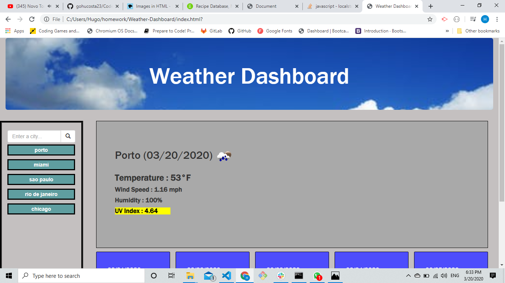
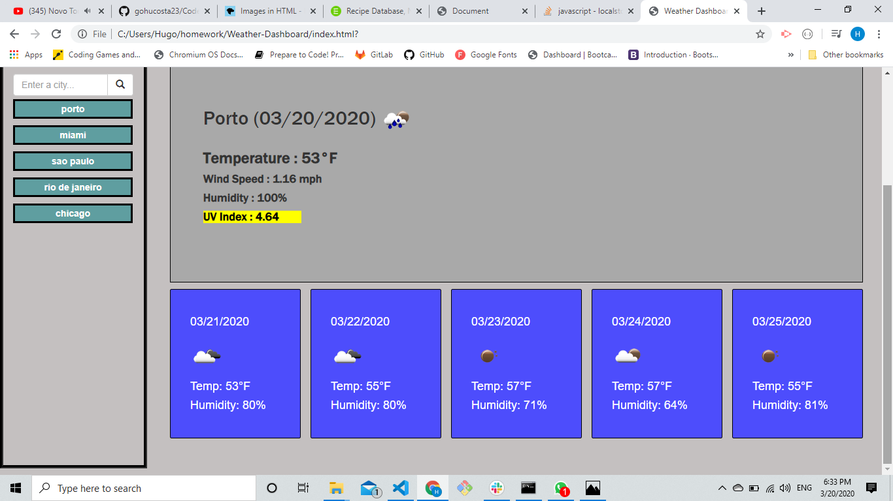
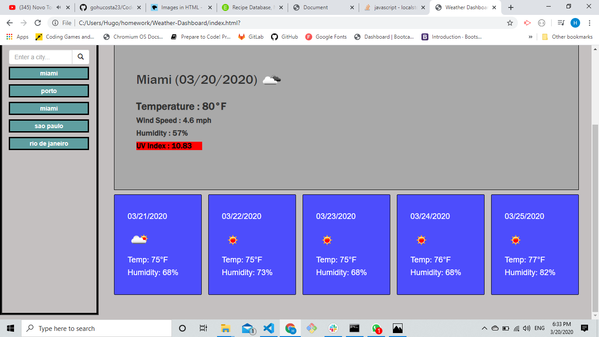

# Weather Dashboard

## Introduction
 
This was a cool project to work on... It was hard, but as things started to fall into place I got very excited and motivated. This weather Dashboard will allow users to search for cities worlwide giving them the current weather information like ...
 itit 
<ul>
<li>Temperature</li>
<li>Icon displaying what the weather looks like</li>
<li>Wind Speed</li>
<li>Humidity</li>
<li>UV index</li>
</ul>
 
Obs.: The UV Index is color coded to indicate whether the conditions are favorable, moderate, or severe.

## Instruction

1.The user will have an input on the left side where they can enter a city name to search for weather. Also, below the city search input will be the search history of cities where they will be able to click on the city names to see the weather for that current city again instead of typing it all in. Right now there is a limit of 5 cities for the search history.
 

 

2. Below the current weather they will be able to see the weather for the next 5 days.
 

 

3.Also, as mentioned above the UV Index on the current weather will be coded  to indicate whether the conditions are favorable, moderate, or severe.
 

## Tools Used

 
<ul>
<li>HTML</li>
<li>CSS</li>
<li>Bootstrap</li>
<li>Jquery</li>
<li>Open Weather map API</li>
</ul>
